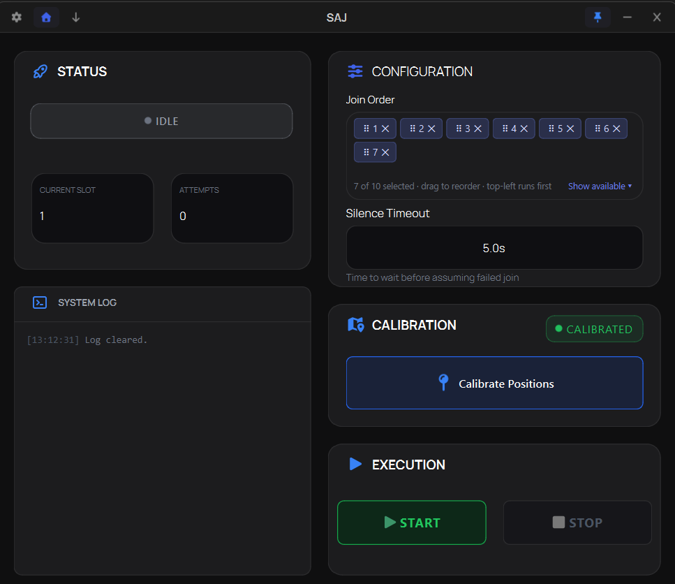
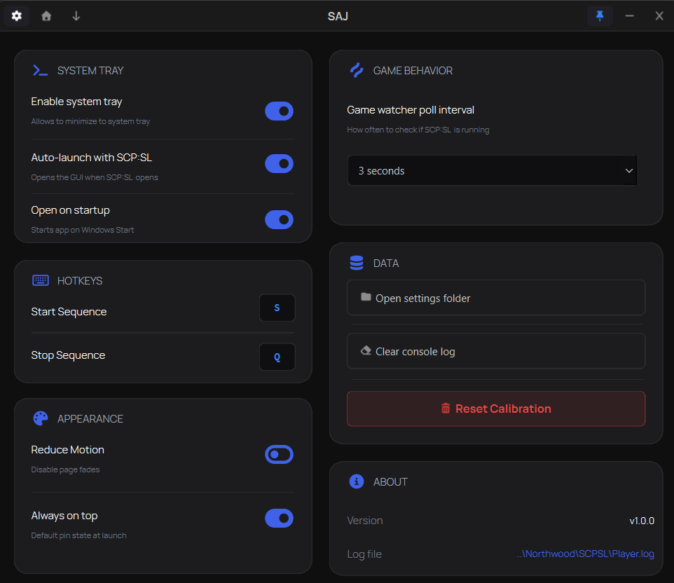
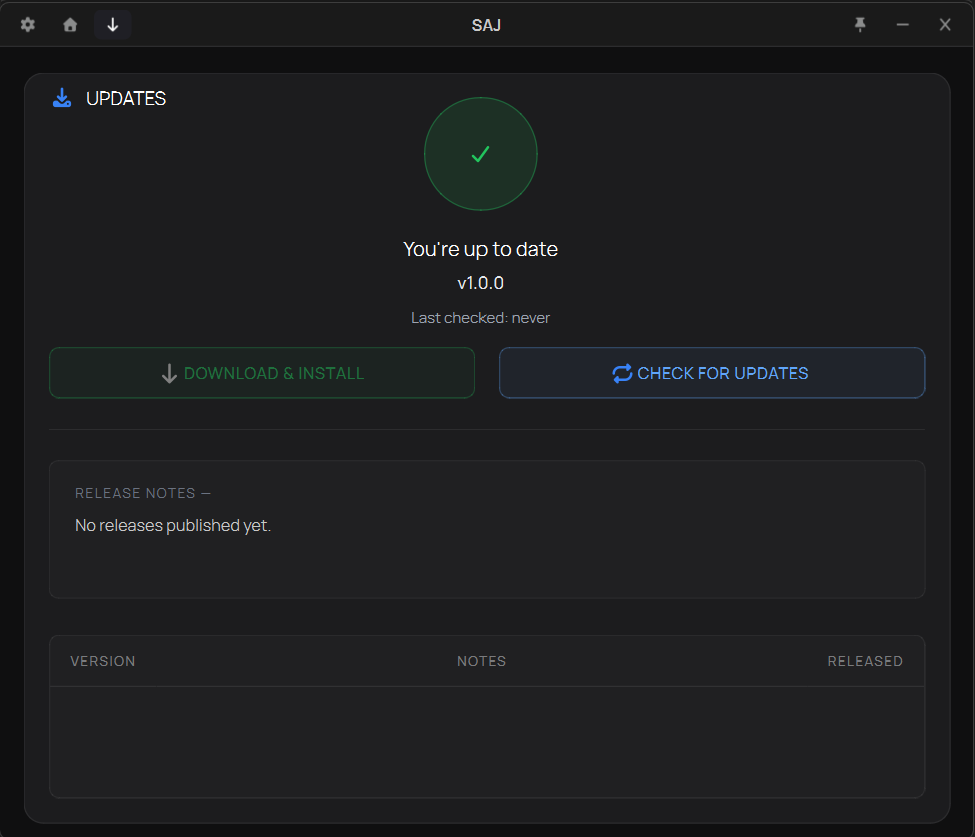

# SAJ — SCP:SL Auto-Joiner

A Windows tool that automates the join process for **SCP: Secret Laboratory** so you don't have to camp the server list manually.



---

## Features

- **Visual join order editor** — drag chips to reorder, click ✕ to remove, click an "Available" chip to add it back.
- **Auto-detects your favorites** — reads `favorites.txt` from your SCP:SL folder and adapts to however many servers you have.
- **Auto-scroll for slots beyond row 6** — SAJ scrolls the favorites list itself when targeting slot 7+, then scrolls back as needed for slots 1–6 in the same cycle.
- **Live favorites refresh** — favorite or unfavorite a server in-game and SAJ updates within ~200ms, no restart needed.
- **OCR fast-fail** — watches the screen for the "Disconnected" popup so SAJ bails on a failed attempt in under a second instead of waiting out the timeout.
- **Silence timeout** — when there's no visible failure signal, SAJ assumes a quiet attempt failed and moves to the next slot. Adjustable per your connection.
- **Three-point calibration** — point SAJ at the Servers button, Favorites tab, and the first two slot positions once. It extrapolates the rest.
- **Toast notifications** — slide-down toasts under the title bar for join successes, calibration steps, update events, and errors.
- **Hotkeys** — `S` to start, `Q` to stop, scoped to the SAJ window.
- **System tray support** — runs quietly in the background and pops up when SCP:SL launches.
- **Built-in updater** — checks GitHub for new releases, shows release notes inline, downloads with a progress ring around the status badge.
- **Version history** — see past releases and what changed; double-click any row to open it on GitHub.

---

## Download

Grab the latest `.exe` from the [Releases page](https://github.com/ryanh-source/saj/releases).

---

## Quick Start

1. **Launch SCP:SL** and get past the main menu.
2. **Open SAJ** — it appears automatically when SCP:SL is detected (toggleable in settings).
3. **Click "Calibrate Positions"** and follow the on-screen prompts. SAJ asks you to hover over the Servers button, the Favorites tab, and the first two slot rows.
4. **Set your join order** in the Configuration panel — every favorite shows up as a chip pre-ordered 1→N. Drag to reorder, click ✕ to remove. Click "Show available ▾" to bring removed chips back.
5. **Press Start** (or hit `S` while SAJ is focused).

---

## Join Order Editor

The Configuration panel shows one chip per favorited server, in your current join order. The leftmost chip runs first.

- **Reorder** — drag a chip by its grip handle to a new position. Other chips slide aside.
- **Remove** — click the ✕ on a chip's right edge.
- **Add back** — click "Show available ▾". Unused slots appear below; click any to re-add it to the end of the order.
- **Auto-refresh** — if you favorite or unfavorite a server in SCP:SL while SAJ is open, the chip list updates automatically.
- **Slots beyond row 6** — SCP:SL only shows 6 favorites at a time. SAJ scrolls the list automatically for slot 7+ and tracks position across attempts so it doesn't waste time scrolling between every slot.

---

## Calibration

SAJ needs to know where four things sit on your screen:

1. The **Servers** button (top nav)
2. The **Favorites** tab
3. The **Slot 1** join button
4. The **Slot 2** join button

Click "Calibrate Positions" on the home page and follow the prompts. Each step gives you 3 seconds to hover the mouse over the target — SAJ captures the cursor position when the countdown ends.

Calibration is shown as toasts under the title bar so you can focus on the game window while it runs. Logs of every captured position go to the System Log card for later reference.

Resolution changes, UI scaling, or window position drift can throw off calibration — just recalibrate when that happens.

---

## Settings



| Setting | What it does |
|---|---|
| **Enable system tray** | Keeps SAJ running in the background tray when closed |
| **Auto-launch with SCP:SL** | Opens SAJ automatically when the game starts |
| **Open on startup** | Starts SAJ on Windows boot |
| **Reduce motion** | Disables UI animations (page fades, icon spin) |
| **Always on top** | Pins the window above other apps by default |
| **Game watcher poll interval** | How often SAJ checks if SCP:SL is running |

The **Hotkeys** section shows the current bindings. The **Data** section gives you quick access to the settings folder, lets you clear the console log, or wipe your calibration data.

---

## Updates



SAJ checks the GitHub releases API on launch and shows the result on the Updates page:

The page also shows release notes for the latest version and a table of earlier releases. Double-click any row to open that release on GitHub.

GitHub allows 60 unauthenticated requests per hour per IP to check for updates

---

## Hotkeys

| Key | Action |
|---|---|
| `S` | Start the join sequence |
| `Q` | Stop |

Hotkeys are scoped to the SAJ window — they don't fire while SCP:SL is in focus.

---

## Troubleshooting

**SAJ isn't clicking the right spots**
Recalibrate. Resolution changes, UI scaling, or window position drift can all throw off the calibration.

**Chips show "No favorites detected"**
SAJ reads `%APPDATA%\SCP Secret Laboratory\favorites.txt`. Favorite at least one server in SCP:SL and the chips will populate.

**Joining slot 7+ scrolls but clicks the wrong row**
The scroll math assumes one mouse-wheel tick = one row, which is the SCP:SL default. If your Windows mouse settings have a non-default scroll speed, slot 7+ may land on the wrong row. Resetting scroll speed to default fixes it.

**SAJ gives up on a server that was actually loading**
Increase the **Silence Timeout** in the Configuration panel. SAJ assumes a join failed if there's no activity in that window; on slow connections or during scene loads, real connects can be quiet for several seconds.

**SAJ doesn't auto-open when I launch SCP:SL**
Check that "Enable system tray" and "Auto-launch with SCP:SL" are both on. The auto-open behavior depends on the watcher running in the background.

**The hotkeys don't work**
The SAJ window needs focus — `S` and `Q` are intentionally scoped to it. Click the SAJ window once before pressing.

**Update check says "GitHub returned HTTP 403"**
You've hit GitHub's 60-checks-per-hour limit. Wait an hour and the quota resets. (If this happens during normal use, let me know — it shouldn't.)

---

## Building from source

```bash
git clone https://github.com/ryanh-source/saj.git
cd saj
pip install -r requirements.txt
python main.py
```

**Requirements:** Python 3.12, Windows

---

## Disclaimer

SAJ is a third-party tool **not affiliated with or endorsed by Northwood Studios**. It automates the same clicks a player would make manually — no game memory access, no network manipulation. Use it at your own discretion.